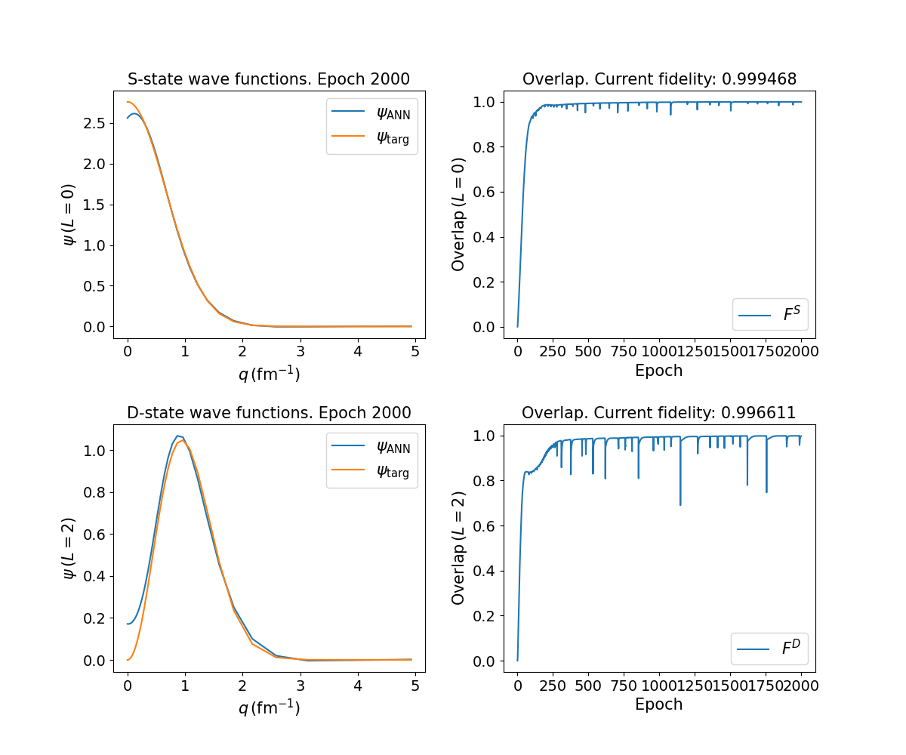
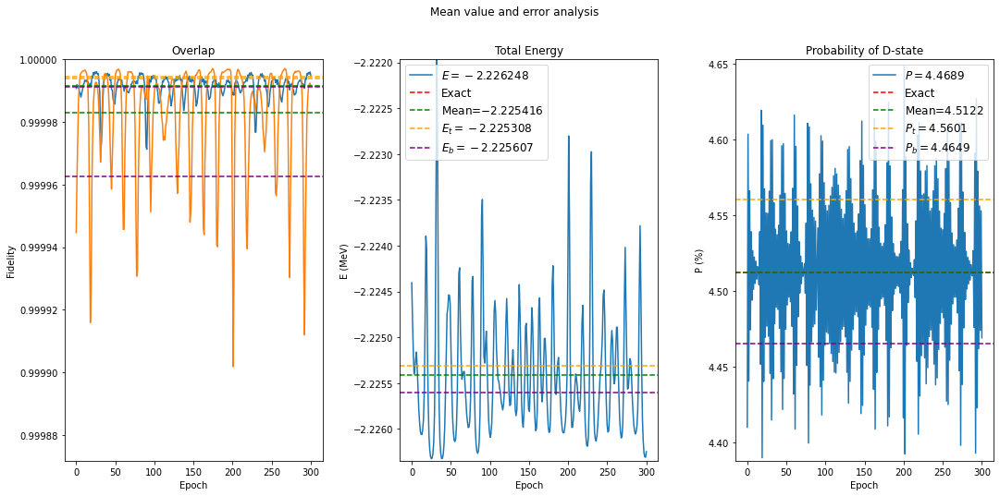
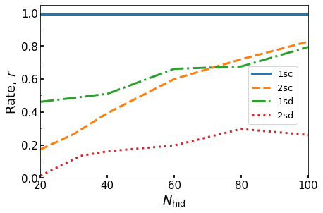
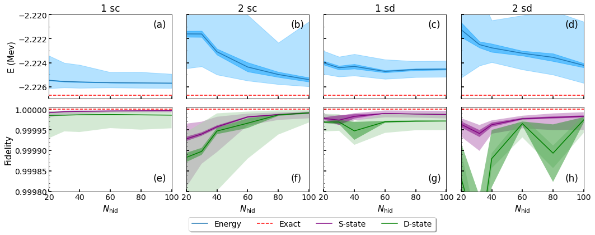
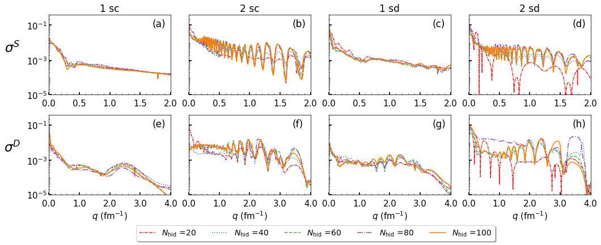

# Solving the deuteron
This repository contains the code used to generate the results in this [article](https://doi.org/10.1140/epjp/s13360-024-04983-w) (published in [EPJ Plus](https://link.springer.com/journal/13360)).

## Requirements
The machine learning part of the code in the files above is written in PyTorch. It does not come with the default Python 3 installation; to install it, go to [Official PyTorch page](https://pytorch.org/get-started/locally/) or type:

`pip3 install torch`

Also, the progress bar `tqdm` is used. To install it:

`pip3 install tqdm` 

## Model training guide
-------------------------------------------------------------------------------------------------------------------------------------------------------------------------
The steps below are intended to provide guidance through the code files in this repository. These cover the whole training process of the Artificial Neural Networks as well as the generation of the figures that appear in the article. Every file has command-line help detailing the available flags to use when running the file. This help menu can be accessed by running the file with the `-h` flag, for example: `python3 file.py -h`.

### Step 1. Pretraining.
The file `pretraining.py` trains an ANN to match two wave function-like functions. We set command-line arguments to our preference and run the file. This will store the models and the plots in `saved_models/pretraining/.../`, where the dots are a proxy for a set of subdirectories named after the hyperparameter combinations of our choice.

### Step 2. Training.
We now run the script `deuteron.py`. This file trains the ANN to minimize the energy. A loop is already programmed that will sequentially load the pretrained models (Step 1). The code allows to split the total list of pretrained models into batches so as to seize parallelized computing (clusters). The models thusly trained are automatically stored (if desired) in `saved_models/n3lo/...`. By the end of this step we already have a fully trained model.

Note: the steps below are dedicated to error analysis and plotting.

### Step 3. Error analysis.
We run the script `error_analysis/error_measure.py` with the desired arguments. This file can automatically compute the errors of the trained models. A loop is already programmed that will sequentially load the trained models (Step 2). This will save E, Ks, Kd, Pd with their corresponding errors under the `error_data/` folder. 

In order to generate FIG. 3 in the article, we can run the script `error_analysis/oscillation_error_plot.py`, and this will generate the figure and store it in `saved_plots/oscillation_error_plot.pdf`.

### Step 4. Filtering the good runs.
We run the script `error_analysis/filter.py` with the desired arguments. This program filters the trained models and selects the ones that match our criteria (defined via the initial parameters). The selected runs are copied in a folder named `filtered_runs/` found under the `error_analysis/error_data/` folder.

### Step 5. Convergence rates.
We run the script `error_analysis/convergence_rate/convergence_rate.py` with the desired arguments. This file will compute the energy errors and convergence rate of the specified models and store this data under the `error_analysis/error_data/...` folder. This step generates the data needed for FIG. 2 of the paper and Tables II and III.

In order to generate FIG. 2 in the article, we can run the script `error_analysis/convergence_rate/convergence_rate_plot.py`, and this will generate the figure and store it in `saved_plots/convergence_rate.pdf`.

### Step 6. Plotting energy and fidelity.
In order to generate FIG. 4 in the article, we run the script `energy_fidelity_plot/energy_fidelity_plot.py` with the desired arguments. Text files under the folder `energy_fidelity_plot/plotting_data/` with further errors will be generated in the process. Once the program is done, the resulting plot will be stored in `saved_plots/master_plot.pdf`. 

### Step 7. Plotting wave functions and their variances.
We run the script `error_analysis/wf_variance/wf_var.py` with the desired arguments. This file will generate data in the same folder where it is located, which is necessary to generate FIGs. 5 and 6 of the paper.

In order to generate FIG. 5 in the article we run the script `error_analysis/wf_variance/var_plot_wf.py` with the desired arguments. This will generate the figure and store it in `saved_plots/wf_variance_wf.pdf`. 

In order to generate FIG. 6 in the article we run the script `error_analysis/wf_variance/var_plot_stdev.py` with the desired arguments. This will generate the figure and store it in `saved_plots/wf_variance_var.pdf`. 

### Step 8. Overfitting quantification
We run the script `error_analysis/wf_variance/overfitting_quantification.py` with the desired arguments. This action will cause a print out to the console with the values found in TABLE I of the paper.

-------------------------------------------------------------------------------------------------------------------------------------------------------------------------
